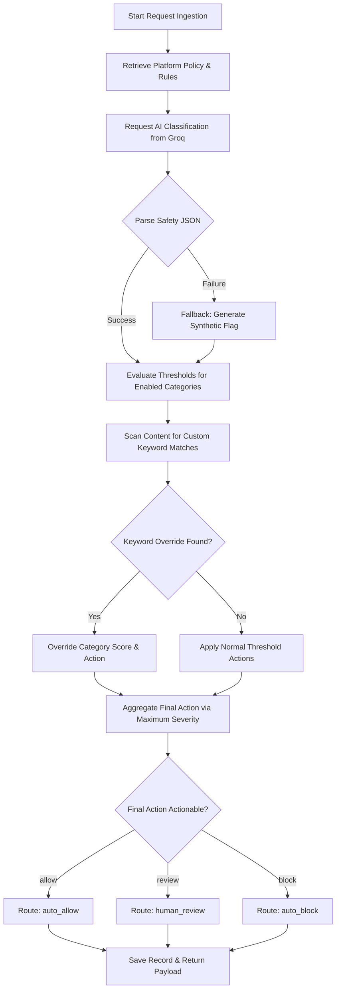
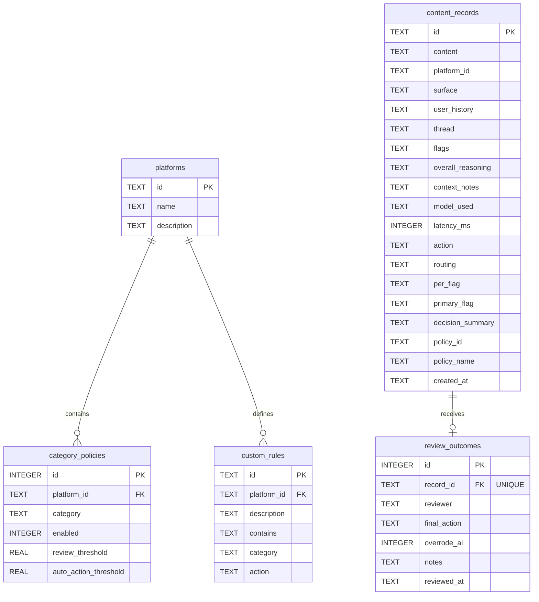

# 🛡️ AI-Powered Content Moderation Pipeline

An intelligent, multi-stage content moderation system that combines **Context-Aware Large Language Model (LLM) classification**, **deterministic platform-specific rules**, and a **human-in-the-loop review queue** to ensure community safety.

This repository features a fully integrated **React frontend** and an **Express (Node.js) backend** utilizing a WebAssembly-based **SQLite database (`sql.js`)** and **Groq Cloud API** (`llama-3.3-70b-versatile`) for ultra-low latency AI decision-making.

---

## 🚀 Key Features

*   **Context-Aware AI Classification**: Moderates text content by considering the conversation surface, author history, and dialogue threads.
*   **Per-Platform Policies**: Tailor threshold policies for different contexts (e.g., kids' platforms have strict limits; gaming lobbies tolerate friendly banter).
*   **Custom Keyword Overrides**: Direct word/phrase matching that immediately triggers Allow, Block, or Human Review actions, bypassing AI inference logic.
*   **Interactive Review Queue**: Modern inbox interface for human moderators to audit borderline AI decisions and record overrides.
*   **Analytics Dashboard**: Visualizes pipeline throughput, agreement rates, block counts, and human-AI agreement levels.
*   **Dynamic Highlighting**: Automatically scans and highlights offending text spans identified by the AI system.

---

## 🛠️ Tech Stack

### Frontend
*   **React 18.3** (UI Library)
*   **React Router DOM 6.26** (Client-side Routing)
*   **Vanilla CSS** (Responsive Design & Theming)
*   **Vite** (Build Tool & Development Server)

### Backend
*   **Node.js & Express** (Web Framework)
*   **sql.js** (WebAssembly SQLite Port)
*   **Groq SDK** (LLM API Client)
*   **dotenv** (Environment Configuration)

---

## 📂 Folder Structure

```text
AI_Content_Moderation_Pipeline/
├── backend/
│   ├── db/
│   │   ├── database.js     # DB init, table schemas
│   │   ├── query.js        # SQL query wrappers
│   │   ├── records.js      # Data formatting adapters
│   │   └── seed.js         # Initial mock policies & custom rules
│   ├── moderation/
│   │   ├── constants.js    # Classification categories
│   │   ├── classifier.js   # Groq API LLM integration
│   │   └── policyEngine.js # Threshold logic & custom rules overrides
│   ├── routes/
│   │   ├── content.js      # Ingestion & moderation history routes
│   │   ├── policies.js     # Policy administration routes
│   │   └── queue.js        # Moderator queue & stats routes
│   ├── server.js           # Server bootstrap
│   └── package.json
└── frontend/
    ├── src/
    │   ├── components/     # StatCard, RoutingBadge, FlagCard, Navbar
    │   ├── pages/          # Dashboard, SubmitContent, ReviewQueue, PolicySettings
    │   ├── api.js          # API client wrapper
    │   ├── App.jsx         # Navigation & notifications routing
    │   ├── index.css       # Core styling & design system
    │   └── main.jsx        # App bootloader
    ├── index.html          # HTML Entrypoint
    └── vite.config.js      # Vite dev-server proxy setup
```

---

## 📐 Architecture & Design

### System Overview & Network Topology
The system utilizes a client-server-model decoupled architecture. Requests are proxied from the web interface through a development proxy to the node application container. The backend coordinates data queries locally using WebAssembly SQL, dispatches inference calls to Groq Cloud infrastructure, and performs localized aggregation before persisting records.

```text
   +---------------------------------------+
   |            React Client               |
   +---------------------------------------+
                       | HTTP REST
                       v (Proxied via Vite /api)
   +---------------------------------------+
   |         Express Web Service           |
   +---------------------------------------+
     |                    |               |
     | Load Policy Config | Write-Through | Dispatch Inference
     v                    v               v
+----------+        +-----------+   +-------------------+
|  sql.js  |<------>|  Disk File|   |  Groq API Cloud   |
| (Memory) |        | (.db file)|   | (Llama-3.3-70B)   |
+----------+        +-----------+   +-------------------+
```

### Request-Response Lifecycle
1.  **Ingestion**: Client posts content, platform reference, and contextual metadata to `/api/moderate`.
2.  **Policy Retrieval**: Backend loads target platform settings, category thresholds, and keyword rule overrides from the database.
3.  **AI Classification**: The system formats and dispatches context metadata, dialogue threads, and the text payload to Groq's API.
4.  **Local Rule Aggregation**: The policy engine evaluates category confidence scores against thresholds and scans keywords for overrides.
5.  **Persistence**: The resulting record is stored in SQLite and flushed to the disk.
6.  **Response**: The updated record is returned to the client.

### Decision Engine Workflow


---

## 🛠️ Engineering Documentation

### Key Design Decisions
*   **Decoupled Policy Engine**: Separating AI classification from threshold evaluations allows administrators to adjust platform policies without needing to re-run expensive AI inference.
*   **WebAssembly Database**: Using `sql.js` allows the database to run in memory without external services or native build dependencies.

### Design Trade-offs
*   **Synchronous Processing vs. Queue Pipelines**: The backend processes moderation requests synchronously, blocking requests while waiting for the AI response. While simpler to implement, a task worker queue (e.g. BullMQ) would be better for high-traffic environments.
*   **In-Memory DB Sync**: `sql.js` writes changes to disk by exporting and saving its entire memory buffer after each write operation, which can cause performance bottlenecks under write-heavy loads.

### Assumptions & Limitations
*   **Single-Session Reviews**: Only one moderator is assumed to audit the review queue at a time. The system lacks database transaction locking, exposing it to potential race conditions if multiple moderators review the same item simultaneously.
*   **English Language Bias**: Prompt instructions are written in English, which may affect the classification accuracy of non-English content.

### Error Handling Strategy
*   **Synthetic Fallback**: If the AI API fails, the backend catches the error and generates a synthetic warning flag (category: `harassment`, confidence: `0.50`, action: `review`), routing the content to the human queue for safety.
*   **Client Response Safety**: Database write errors or missing configurations return structured error responses (e.g. `400 Bad Request` or `500 Internal Server Error`) instead of crashing the server.

---

## 💾 Database Documentation

### Entity Relationship Diagram


### Table Relationships & Datatypes
*   **JSON Serialization**: Columns like `thread`, `flags`, and `per_flag` are stored as `TEXT` in SQLite and parsed back into JSON arrays during retrieval:
    ```javascript
    thread: JSON.parse(row.thread || '[]')
    ```
*   **Cascade Deletions**: Deleting a platform or moderation record automatically cleans up associated custom rules, category policies, and review outcomes:
    ```sql
    FOREIGN KEY(platform_id) REFERENCES platforms(id) ON DELETE CASCADE
    ```

---

## 🤖 AI / LLM Integration

### Prompt Architecture
The system instructions in [classifier.js](file:///c:/Users/aryan/Downloads/AI_Content_Moderation_Pipeline-main/AI_Content_Moderation_Pipeline-main/backend/moderation/classifier.js) configure the LLM to act as a structured classification engine. 
* System instructions detail the categories, specify formatting rules, and define confidence ranges.
* User inputs inject context details (e.g. settings, history, thread) before the raw content:
  ```text
  PLATFORM: <platform_id>
  SURFACE: <location_context>
  CONVERSATION THREAD:
    <author_1>: <message_1>
  <<<CONTENT
  <raw_text>
  CONTENT>>>
  ```

### JSON Mode Configuration
The Groq SDK call is configured to enforce structured JSON outputs:
```javascript
response_format: { type: 'json_object' }
```
This forces the model to return structured data matching the specified schema, ensuring it can be parsed directly by the server.

---

## 🛡️ Security Architecture

### Key Security Priorities
1.  **Input Parameterization**: All SQL queries use parameters to prevent SQL injection vulnerabilities:
    ```javascript
    dbGet('SELECT * FROM platforms WHERE id = ?', [platformId])
    ```
2.  **Payload Boundaries**: The API server restricts JSON payloads to `1mb` to prevent memory exhaustion attacks.
3.  **Client Escaping**: React escapes rendered variables in JSX automatically, protecting against Cross-Site Scripting (XSS) attacks.

### Vulnerabilities & Future Improvements
> [!WARNING]
> This application is configured as a development sandbox. It lacks API authentication, exposing settings and review tables to the public.

*   **API Authentication**: Future updates should implement JWT-based access controls for administrative endpoints like `/api/policies`.
*   **Rate Limiting**: Implementing a rate-limiting middleware (e.g. `express-rate-limit`) would protect endpoints from abuse.

---

## ⚡ Performance & Scalability

*   **API Latency**: Groq API calls generally resolve in 300ms–650ms.
*   **Database Writes**: Writing memory buffers to disk takes 5ms–20ms. SQLite locks during writes, which can create queues under heavy write loads.

### Scaling Path
1.  **Caching**: Implement Redis cache to store platform configurations, reducing database read overhead.
2.  **Database Migration**: Migrate from local SQLite files to a managed database service like PostgreSQL or MySQL.
3.  **Horizontal Scaling**: Deploy stateless server instances behind a load balancer to distribute traffic.

---

## 🧪 Testing Strategy

### Example Edge Case Tests
1.  **Malformed Input**: Verify that empty strings or strings containing only whitespace are rejected with a `400 Bad Request` error.
2.  **Special Characters**: Verify that inputs containing code structures (e.g. `"<script>alert(1)</script>"`) are sanitized and handled as plain text.
3.  **Groq Recovery**: Verify that the application falls back to a synthetic flag and routes the content to review if the API fails.

---

## 🚀 Production Deployment Checklist

### Environment Variables
| Variable | Description | Default | Required |
| :--- | :--- | :--- | :--- |
| `PORT` | API Server listening port | `4000` | No |
| `GROQ_API_KEY` | Groq developer console API token | None | Yes |
| `MODERATION_MODEL` | AI inference model variant | `llama-3.3-70b-versatile` | No |

### Deployment Checklist
* [ ] Verify that the `GROQ_API_KEY` is set in the production environment variables.
* [ ] Configure CORS allowed origins to match the client domains.
* [ ] Verify that the server directory has write permissions to save `moderation.db`.
* [ ] Set up daily backups for the database files if deploying on ephemeral filesystems.

---

## 👥 Contribution Guidelines

### Branching Model
*   `main`: Production-ready code.
*   `dev`: Integration branch for testing new features.
*   Feature branches should follow the naming convention: `feature/username-feature-name`.

### Coding Rules
*   Run the linter before submitting commits to ensure clean, consistent formatting.
*   Do not commit `.env` configuration files to the repository.

---

## 📈 Portfolio Highlights & System Evaluation

*   **Context-Aware AI Routing**: Evaluates content within its context rather than relying on static filters.
*   **Dynamic Highlighting**: Automatically parses and highlights violating text segments in the UI.
*   **Flexible Platform Policies**: Allows different safety thresholds and keyword rules to be applied to different channels.

---

## ⚙️ Installation & Local Setup

### Prerequisites
*   Node.js (v18 or higher)
*   A Groq Cloud API Key (Get one from [Groq Console](https://console.groq.com/))

### 1. Clone & Set Up Backend
Navigate to the `backend` folder, install dependencies, and configure environment variables:

```bash
cd backend
npm install
```

Create a `.env` file in the `backend/` directory:

```env
PORT=4000
GROQ_API_KEY=your_groq_api_key_here
MODERATION_MODEL=llama-3.3-70b-versatile
FRONTEND_URL=http://localhost:5173
```

Start the backend server in development mode:

```bash
npm run dev
```

The backend starts on `http://localhost:4000`.

### 2. Set Up Frontend
Open a new terminal, navigate to the `frontend` folder, and install dependencies:

```bash
cd frontend
npm install
```

Start the Vite development server:

```bash
npm run dev
```

The frontend launches on `http://localhost:5173`. Vite is pre-configured to proxy `/api` requests to the local backend on port 4000.

---

## 🛡️ API Documentation (Postman Summary)

### Content Moderation Endpoints
*   **POST `/api/moderate`**
    *   **Description**: Ingests, classifies, and saves text under a specified policy.
    *   **Body**:
        ```json
        {
          "content": "I'm going to kill you next round 😂",
          "context": {
            "platformId": "gaming",
            "surface": "competitive match lobby",
            "userHistory": "no prior offenses"
          }
        }
        ```
    *   **Response**: `200 OK` with full classification breakdown, policy applied, routing action (`auto_allow`, `auto_block`, `human_review`), and latency details.

*   **GET `/api/records`**
    *   **Description**: Retrieves the 200 most recent moderation records.
    *   **Response**: List of moderated items containing confidence scores, decision actions, and timestamps.

### Queue & Review Endpoints
*   **GET `/api/queue`**
    *   **Description**: Fetches items marked for `human_review` that haven't been resolved.
*   **POST `/api/queue/:id/review`**
    *   **Description**: Submits moderator's decision.
    *   **Body**:
        ```json
        {
          "reviewer": "moderator-1",
          "finalAction": "allow",
          "notes": "Legitimate competitive friendly banter."
        }
        ```

### Policy Settings Endpoints
*   **GET `/api/policies`**: Returns list of platform configurations and thresholds.
*   **PUT `/api/policies/:id`**: Updates platform thresholds, enabled categories, and custom keyword list.
*   **POST `/api/policies/reset`**: Resets all platform policies to developer defaults.
